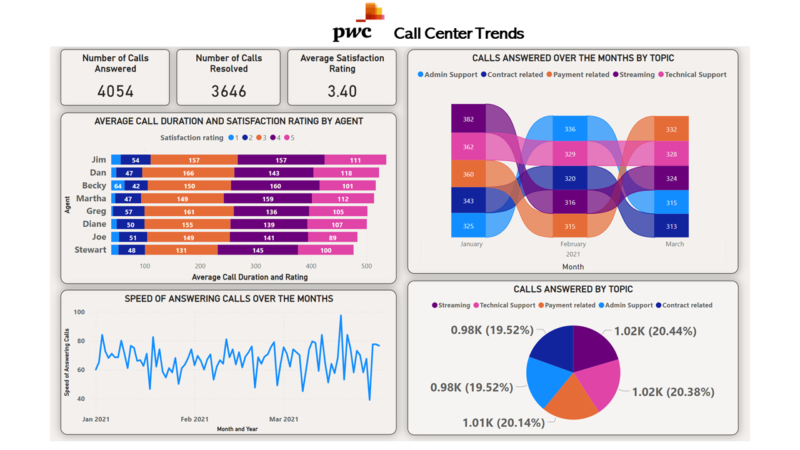

# PWC Switzerland Power BI Visualization for Call Center Data

  

## Overview

Utilizing Power BI, I developed a Quick Digest Dashboard providing a comprehensive view of key metrics and KPIs for a call center environment. The dashboard showcases a summary of calls answered and resolved, average satisfaction ratings, and a detailed breakdown of calls by topic and agent.

## Interactive Dashboard

Click [here](https://app.powerbi.com/view?r=eyJrIjoiYjMzOTY5ZWItZWE0ZS00ZmQwLWEwYWQtNmViZTE1MGM1NTdjIiwidCI6IjBmZWQwM2EzLTQwMmQtNDYzMy1hOGNkLThiMzA4ODIyMjUzZSIsImMiOjEwfQ%3D%3D) to interact with the PowerBI dashboard.

## Screenshot

